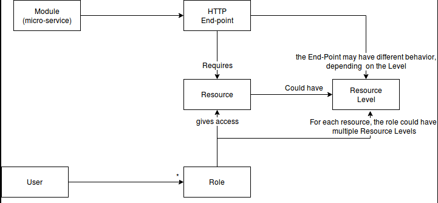
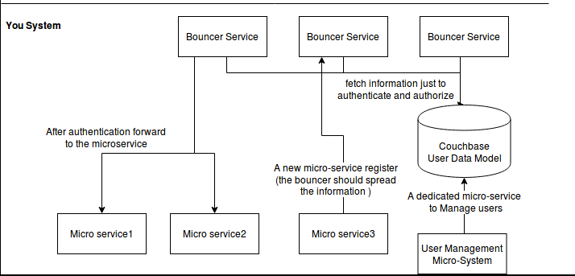

## Motivation
Authentication and authorization may be a problem in a micro service environment. 
If every micro service has its own authentication and authorization, you end up 
with multiple services doing the same thing, and perhaps with different implementations.

The cleanest way of doing it is with a service dedicated to authentication and authorization, I'm going to call this service the **bouncer service**.

**Abstract:**
1. [Concept map - the problem domain](#concept-map)
1. [High level implementation](#high-level-implementation)
   1. [Identified implementation problems](#problems)
1. [Implementation](#implemetation)
    1. [ Flow: new 'http request' comes](#flow-new-request-comes)
    1. [ Registration of a new micro-service](#new-micro-service)
    1. [ Extract 'auth resources' from http request](#extract-auth-resource)
    1. [ Store data in Couchbase](#data-storage)
    1. [Easy to use in Development Environment](#care-about-your-developer)

## Concept map - the problem domain 

Example of instantiation:
- **Resource1**
- **Resource2** with levels: admin, lvl1, actions, reports
- **Role1** has Resource1, resource2(lvl1)
- **Role2** has Resource1, resource2(lvl1, reports)
- **Role3** has Resource1, resource2(lvl1, actions)
- **Role4** has Resource1, resource2(admin)
- **User1** has role2
- **User2** has role3
- **User3** has role2 and role3

The **user3** has the resource2 with levels lv1, actions and reports

## High level implementation

### Identified implementation problems

- When we receive an Http Request, what flow should we have ? [Answer](#flow-new-request-comes)
- How can the Bouncer service know all the micro-services and what resources does it have ? [Answer](#new-micro-service)
- How can we extract the required resources from an Http request ? [Answer](#extract-auth-resource)
- How can we store our data model ? [Answer](#data-storage)
- Should the micro services communicate between than ? Or should they use the Service Bouncer? To be answered in the future post!
- Forcing differents teams, perhaps with different technologies, to use the Service bouncer may be a problem. What care should we take to be easy to use in development environment? [Answer](#care-about-your-developer)

## Implementation

### Flow new request comes
 
 1. The request arrives to the system
 2. The request is **authenticated** (convert the jwt, into the user)    
 2. The http path is processed to: 
 		1. Extract the micro service we want to reach.
 		2. [Extract the resource in that request](#extract-auth-resource) we want to use.
 2. We know the user, the micro-service and the resource.
 2. Now we can process all the information to perform **Authorization**
 	1.1. The answer could be negative
 	1.2. Or Positive
 	1.2. Or Positive, but with conditions (levels of access)  
 3. The request is forwarded to the micro service, with levels of access.

### Registration of a new micro-service

1. When a new micro service launches, it should have a configured end point to reach the bouncer service.
2. And the new micro service will send, to the bouncer service, something like this to register itself: 

~~~json   
{
   "name":"name-of-example1",
   "version":"v0.0.1",
   "forwardHost":"api-internal.example1.com",
   "paths":{
	 "GET:/path1/" : {
	 	"require":["resource1"]
	 },
	 "POST:/path1/" : {
	 	"require":["resource1"]
	 },
	 "GET:/path1/:ID" : {
	 	"require":["resource1", "resource2"]
	 }
   },
   "resources":[
   	 {"code":"resource1", "levels":["level1", "level2", "level3"]},
   	 {"code":"resource2"}
   ]

}
~~~

With the version it should be possible to **run multiple versions at a time**, and the bouncer service could have special behaviours to handle multiple versions. This feature could facilitate [blue-green deploys](https://martinfowler.com/bliki/BlueGreenDeployment.html). 

All paths are declared and mapped to resources. So that, when the service bouncer receives the request:
`GET <host>/path1/125` it knows that it **requires**: `resource1` and `resource2`. 
So it will search if the authorized user has access it.
 - if the user doesn't have access to it, the request will not be forwarded.
 - if the user has access to it, the request will be forwarded, adding in to the http headers the *level* of resource1. 

### Extract 'auth resources' from http request

The service bouncer could create a suffix tree of all paths in the infrastructure, [Suffix tree](https://en.wikipedia.org/wiki/Suffix_tree).

Something like this:

~~~~
"path1/"
   -> <endPath> 
          -> GET  {fullPath: GET:path1, requires:["resource1"]}
   -> <endPath> 
           -> POST {fullPath: POST:path1, requires:["resource1"]}
   -> <anyIntValue> 
          -> <endPath> 
                 -> GET {fullPpath: POST:path1/:id, requires:["resource1", "resource2"]}
~~~~

The information stored in the leaf of that tree could store the required **resources**.

Knowing this, the Bouncer service will extract from the http headers the resources it requires.
The Http request will only be forwarded to the micro service if the actual user has access to the resources. 

### Store data in Couchbase

1. First authentication:
 The request will arrive to the Bouncer Service with a [Json web token (JWT)](https://jwt.io/introduction/).
  Using the secret we will guarantee that it is a valid token.
     OR
   We could use the old fashioned RANDOM TOKEN that maps the database to the userId.

2. After having a valid user id, we can search in the couchbase for the key `p:$user1`
3. Now we search all the roles of that user, example `r:role1` and `r:role2`
4. Then we know all the resources and levels for that user.
5. Since the resource was already [parsed bellow](#extract-auth-resource),
   we know everything to authorize and forward this request.   

#### Couchbase keys
~~~~
p:$userId => {"roles":["role1", "role2"]}

r:$roleCode => {"resources":{"resource1":{"with":["level1"]}, "resource2":{}}}
~~~~

### Easy to use in Development Environment

There are multiple differents things to do:

- Distribute the Service Bouncer inside a docker (You can use also have the couchbase inside a docker).
- Have SDK for your different languages
- Create good error messages, that can provide you real information.

It is not difficult to create easy to use systems, but you should keep this in mind when you build something that is going to be used by multiples teams.
